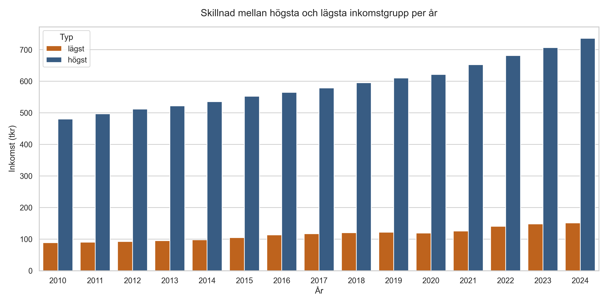
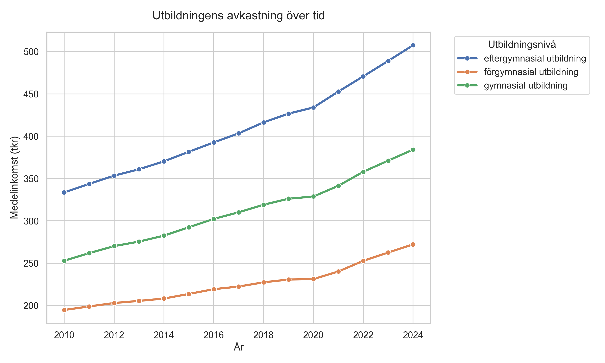
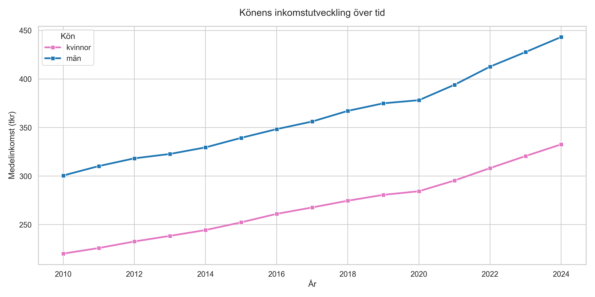
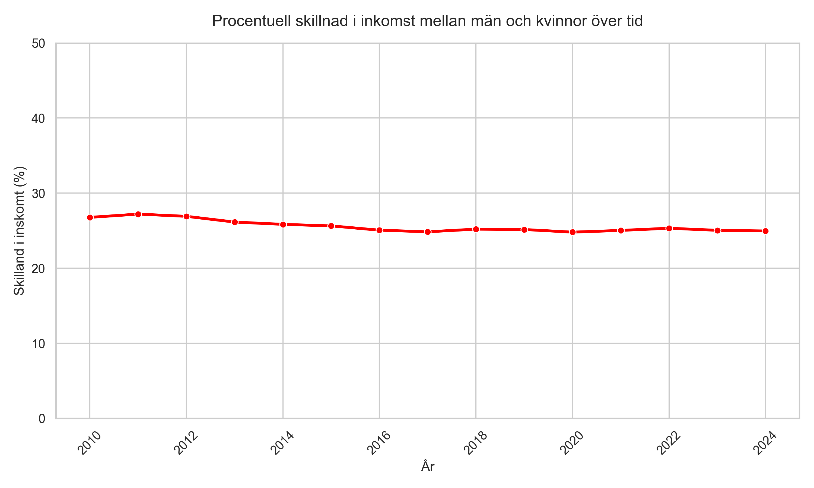
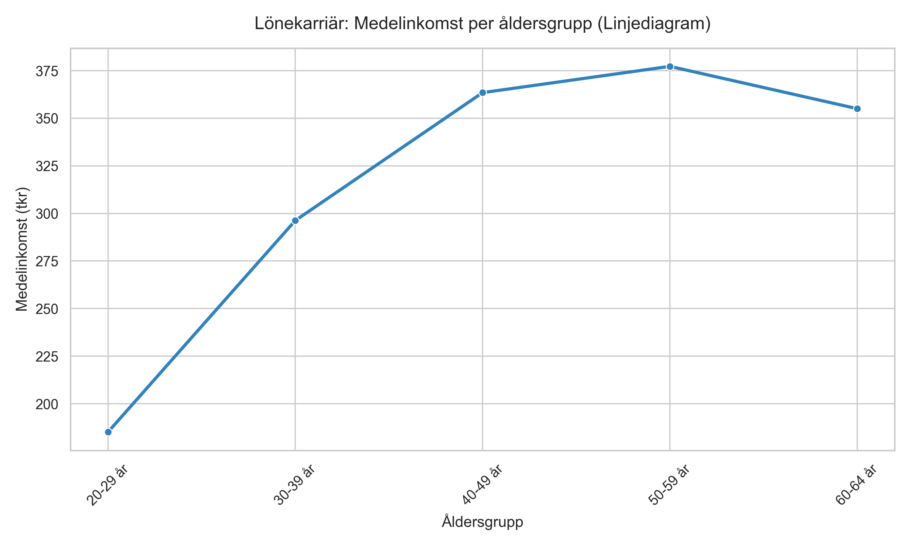

```{python}
#| echo: false
#| message: false
#| warning: false

import pandas as pd

extremes_df = pd.read_csv("data/processed/yearly_income_extremes.csv")

first_year = int(extremes_df["year"].min())
latest_year = int(extremes_df["year"].max())

latest_high = extremes_df[(extremes_df["year"] == latest_year) & (extremes_df["typ"] == "högst")].iloc[0]
latest_low = extremes_df[(extremes_df["year"] == latest_year) & (extremes_df["typ"] == "lägst")].iloc[0]

high_income = float(round(latest_high["inkomst_tkr"], 1))
low_income = float(round(latest_low["inkomst_tkr"], 1))
diff_income = float(round(high_income - low_income, 1))

first_high = extremes_df[
    (extremes_df["year"] == first_year) &
    (extremes_df["kön"] == latest_high["kön"]) &
    (extremes_df["utbildningsnivå"] == latest_high["utbildningsnivå"])
].iloc[0]

first_low = extremes_df[
    (extremes_df["year"] == first_year) &
    (extremes_df["kön"] == latest_low["kön"]) &
    (extremes_df["utbildningsnivå"] == latest_low["utbildningsnivå"])
].iloc[0]

high_increase = float(round(high_income - first_high["inkomst_tkr"], 1))
low_increase = float(round(low_income - first_low["inkomst_tkr"], 1))

high_increase_pct = float(round((high_increase / first_high["inkomst_tkr"]) * 100, 1))
low_increase_pct = float(round((low_increase / first_low["inkomst_tkr"]) * 100, 1))
```

# Introduktion

Denna rapport sammanställer och analyserar inkomstdata från Statistiska centralbyrån (SCB). Syftet är att undersäka hur medelinkomsten varierar beroende på faktorer som utbildningsnivå, kön och ålder, samt hur dessa realtioner har förändrats över tid.

Data har genomgått en automatiserad validerings- och bearbetningspipeline där saknade värden har rensats och datatypstransformationer genomförts innan aggregering.



# Extremvärden och Inkomstklyftor

Genom att identifiera den grupp som har högst respektive lägst medelinkomst för varje enskilt år kan vi studera spannet i inkomstfördelningen.

::: {#fig-extremes}
{width="100%"}

Jämförelse mellan den grupp som uppvisar högst respektive lägst medelinkomst per år.
:::

Som visas i @fig-extremes uppgår den högsta noterade medelinkomsten för år `{python} latest_year` till `{python} high_income` tkr (tillhörande gruppen `{python} latest_high['kön']` med utbildningsnivå `{python} latest_high['utbildningsnivå']`). Detta kan jämföras med den lägsta medelinkomst på `{python} low_income` tkr, vilket ger en skillnad på `{python} diff_income` tkr mellan grupperna.

Mellan år `{python} first_year` och `{python} latest_year` ökade medelinkomsten för gruppen med högst inkomst med `{python} high_increase` tkr (en ökning med `{python} high_increase_pct` %) medan motsvarande ökning för gruppen med lägst inkomst var `{python} low_increase` tkr (`{python} low_increase_pct` %)



# Utbildningens Avkastning över Tid

Utbildning ses ofta som en av de mest avgörande faktorerna för individens inkomstutveckling. Figurer @fig-education illustrerar hur medelinkomsten har utvecklats för olika utbildningsnivåer under den analyserade tidsperioden.

::: {#fig-education}
{width="100%"}

Inkomstutveckling sorterad på utbildningsnivå över tid.
:::

Trenden visar tydligt att högre utbildningsnivåer korrelerar med en högre genomsnittlig inkomst samt att inkomstgapet mellan olika utbildningsnivåer har varit realativt stabilt eller ökande över tid.



# Könsgap och Inkomstutveckling

Jämställdhet på arbetsmarknaden studera ofta genom att jämföra medelinkomsten mellan män och kvinnor över tid.

::: {#fig-gender}
{width="100%"}

Medelinkomstens utveckling uppdelad på kön.
:::

I @fig-gender framgår utvecklingen för män respektive kvinnor. Även om båda grupperna visar positiv inkomsttrend över tid finns det fortfarande en tydlig skillnad i medelinkomst.

{#fig-gender-gap}

I @fig-gender-gap ser vi att den procentuella skillanden mellan inkomst för män och kvinnor minskar något över åren dock håller den sig ganska stabil.



# Ålders- och livscykelprofil

Inkomstutveckling över en individs livscykel följer typiskt sett en kurva där inkomsten stiger med yrkeserfarenhet för att sedan plana ut närmare pensionen.

::: {#fig-age}
{width="100%"}

Medelinkomstens fördelad över olika åldersgrupper.
:::

Som illustreras i @fig-age når medelinkomsten sin topp i de mellersta ålderskategorierna vilket återspelar perioden i karriären med hög yrkeserfarenhet och etablering på arbetsmarknaden.